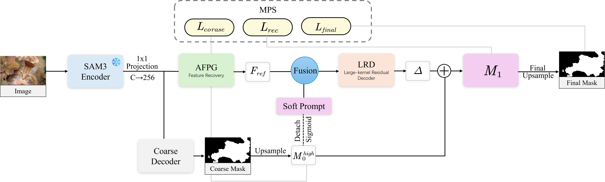
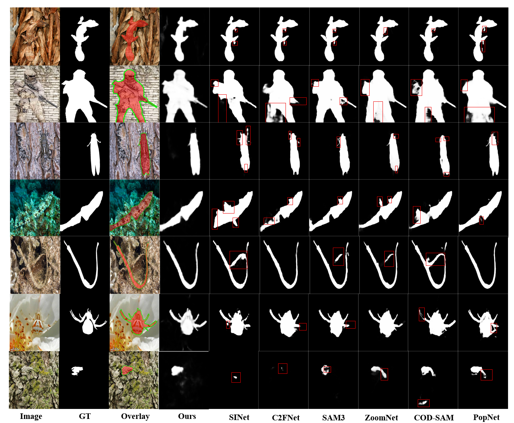

# SRPNet: Structural Recovery from Regional Priors for Camouflaged Object Detection

<p align="center">
  
</p>

<p align="center">
  <b>Decoder-side adaptation of frozen SAM3 features for camouflaged object detection</b>
</p>

<p align="center">
  <a href="#"></a>
  <a href="#"></a>
  <a href="#"></a>
  <a href="#"></a>
</p>

---

## News

- **2026-05-25**: Repository created for the Neurocomputing submission of **SRPNet**.
- Code, pretrained models, and prediction maps will be released progressively.

---

## Introduction

This repository contains the official implementation of **SRPNet**, proposed in:

> **SRPNet: Structural Recovery from Regional Priors for Camouflaged Object Detection**  
> Jing Zhang, Jianbin Liu, Zuhe Li, Weiwei Zhang  
> Submitted to *Neurocomputing*

Camouflaged object detection (COD) aims to segment objects that are visually similar to their surrounding environments. This task is challenging because camouflaged objects often exhibit weak boundaries, low contrast, fragmented structures, and confusing background textures.

SRPNet addresses COD by adapting a **fully frozen SAM3 image encoder** through decoder-side structural recovery. Instead of fine-tuning the foundation-model backbone, SRPNet reformulates COD as a progressive correction process from coarse foreground priors to structural mask recovery.

---

## Highlights

- SRPNet adapts frozen SAM3 features to camouflaged object detection.
- AFPG converts coarse masks into gradient-decoupled soft prompts.
- LRD performs residual compensation for structural recovery.
- MPS stabilizes coarse-to-fine mask optimization.

---

## Method Overview

SRPNet consists of three main components:

- **Adaptive Feature Recovery and Prompt Guidance (AFPG)**  
  Aligns frozen encoder features to a unified recovery resolution and converts coarse foreground responses into gradient-decoupled soft prompts.

- **Large-Kernel Residual Decoder (LRD)**  
  Performs long-range contextual modeling and predicts residual logit-space compensation for recovering missing regions, blurred contours, and subtle structures.

- **Multi-level Progressive Supervision (MPS)**  
  Supervises coarse prediction, recovery-resolution compensation, and final full-resolution prediction to stabilize optimization.

<p align="center">
  
</p>

---

## Qualitative Results

<p align="center">
  
</p>

SRPNet produces more complete object masks and clearer boundaries in challenging camouflaged scenes, including texture camouflage, blurred boundaries, and slender structures.

---

## Main Results

SRPNet is evaluated on three widely used COD benchmarks: **CAMO**, **COD10K**, and **CHAMELEON**.

| Dataset | S-measure ↑ | maxE-measure ↑ | maxF-measure ↑ | MAE ↓ |
|---|---:|---:|---:|---:|
| CAMO | 0.892 | 0.949 | 0.890 | 0.042 |
| COD10K | 0.899 | 0.948 | 0.890 | 0.029 |
| CHAMELEON | 0.900 | 0.949 | 0.890 | 0.033 |

---

## Installation

```bash
git clone https://github.com/LJB123779/SRPNet.git
cd SRPNet

conda create -n srpnet python=3.10 -y
conda activate srpnet

pip install -r requirements.txt
